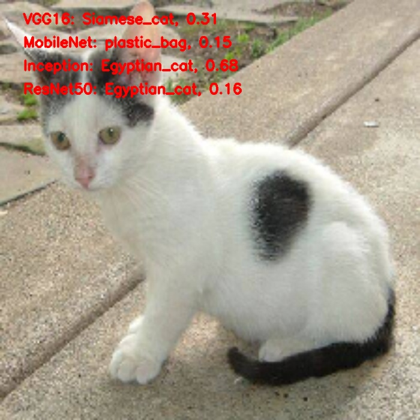

# Phân Loại Ảnh với Pretrained-model

## Tổng Quan

Dự án này thực hiện phân loại hình ảnh sử dụng bốn mô hình học sâu đã được huấn luyện trước: VGG16, ResNet50, InceptionV3 và MobileNet. Hệ thống sẽ xử lý nhiều ảnh trong một thư mục, phân loại chúng bằng các mô hình này và lưu kết quả với nhãn dự đoán được hiển thị trên ảnh.

## Cấu Trúc Thư Mục
```
image-classification/
│── images/     
    |── input     # Thư mục chứa ảnh đầu vào
    |── output    # Thư mục chứa ảnh đầu ra sau khi sử dụng mô hình
│── pretrained-imagenet-models-classification.ipynb   # Script chính để thực hiện phân loại
│── requirements.txt     # Danh sách các thư viện cần cài đặt
│── README.md            # Tài liệu hướng dẫn dự án
```

## Yêu Cầu
+ numpy
+ opencv-python
+ matplotlib
+ tensorflow
+ keras

## Kết quả
Sau khi chạy [text](pretrained-imagenet-models-classification.ipynb) sẽ cho ra kết quả như hình bên dưới



## Có thể download ảnh xe cộ để vọc vạch thêm tại đây [Ảnh xe cộ](https://drive.google.com/drive/folders/1UOYgv7DiSg8prCg4h5d5XeNsbyTJANwg?usp=sharing)